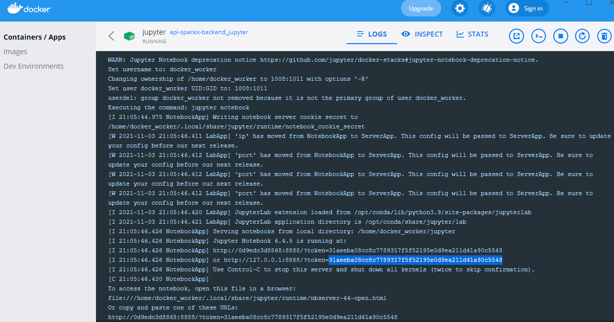

# Influxdb Jupyter notebook proof of concept

This project contains a docker container version of a Jupyter server connected through Docker DNS resolution to a running instance of InfluxDB.

Jupyter notebook works as a simple and fast way to document the usage of InfluxDB.

InfluxDB is a non relational, documental, time indexed database. It has its own GUI displayed on a HTTP service, besides of an API and a Python client used on this project.

# Containers on the project

There are two key containers named **jupyter** and **influxdb**

Containers are build simple running on the project root folder

    docker-compose up

## Jupyter container.

It uses the version of the jupyter/base-notebook docker-hub shared image and add the installation of certain dependencies with pip install.

When up the container shows in hist log the token to access to Jupyter server frontend.

It exposes the port [localhost:8891](localhost:8891), in the host machine and inside the docker network to allow communication to the Jupyter Server.

## Influxdb container.

It uses the version of the influxdb:1.8 docker-hub shared image and add the installation.

It exposes the port [localhost:8086](localhost:8086), in the host machine and inside the docker network to allow communication to this db.

A persistence layer is setted up by a docker volume.

# Key notebooks.

There are available three notebooks to tackle three challenges and solve three problems.

## Load data

On the notebook [./jupyter/01_load_data.ipynb](./jupyter/01_load_data.ipynb) an array of jsons is collected and transformed to be charged on the InfluxDB.

## Filter loaded data

On the notebook [./jupyter/02_last_know_position.ipynb](./jupyter/02_last_know_position.ipynb) the data previously loaded is filtered and retrieved in Python.

## Advanced operation

On the notebook [./jupyter/03_closest_in_time_space.ipynb](./jupyter/03_closest_in_time_space.ipynb) further operations are done with the data and even conversion to **pandas.DataFrame** objects is in place.

To see further details on the data and their context you can check up [original_README.md](original_README.md)
